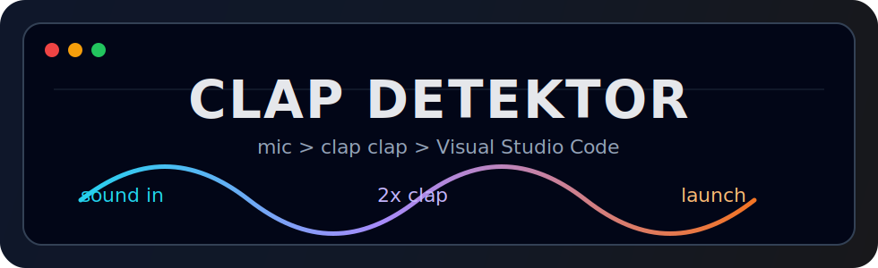

<div align="center">



# clap-detektor

Python CLI aplikace, která poslouchá mikrofon a po dvojitém tlesknutí spustí Visual Studio Code.


</div>

## Demo

<pre>
$ python clap_launcher.py

Listening for clap...
Debug: waiting for 2 clap(s). Detected sounds will be printed here.
Noise calibrated: rms=0.0042

Sound detected: peak=0.381, rms=0.033, high=0.18 -> clap
Clap accepted: 1/2

Sound detected: peak=0.402, rms=0.035, high=0.21 -> clap
Clap accepted: 2/2

Clap detected!
Starting VS Code...
</pre>

## Funkce

- detekce dvojitého tlesknutí
- debug výpis zachycených zvuků
- základní filtrování okolního šumu
- spuštění VS Code nebo jiné aplikace přes `--app`
- výběr mikrofonu přes `--device`

## Instalace

```bash
python3 -m venv .venv
source .venv/bin/activate
python -m pip install -r requirements.txt
```

Na macOS povol mikrofon pro Terminal, iTerm nebo VS Code:

`System Settings -> Privacy & Security -> Microphone`

## Spuštění

```bash
python clap_launcher.py
```

Výchozí režim čeká na 2 tlesknutí a potom spustí Visual Studio Code.

## Příkazy

| Akce | Příkaz |
| --- | --- |
| Spustit výchozí režim | `python clap_launcher.py` |
| Spustit po jednom tlesknutí | `python clap_launcher.py --single-clap` |
| Spustit jinou aplikaci | `python clap_launcher.py --app "Safari"` |
| Vypsat mikrofony | `python clap_launcher.py --list-devices` |
| Použít konkrétní mikrofon | `python clap_launcher.py --device 1` |

## Soubory

<pre>
.
├── assets/
├── clap_launcher.py
├── requirements.txt
└── README.md
</pre>

## Když něco nejde

| Problém | Řešení |
| --- | --- |
| Program neslyší mikrofon | Zkontroluj oprávnění mikrofonu v macOS. |
| Tlesknutí se nezachytí | Tleskni blíž k mikrofonu nebo zkus jiný vstup přes `--device`. |
| Nevíš, který mikrofon použít | Spusť `python clap_launcher.py --list-devices`. |
