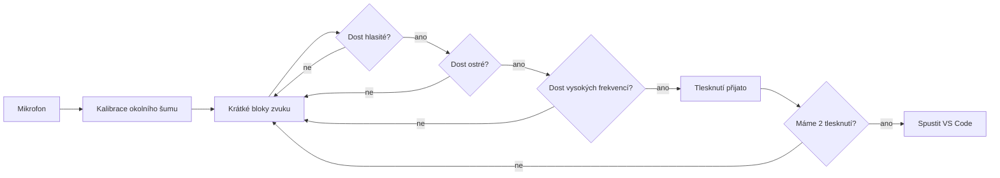

<div align="center">

<pre>
┌──────────────────────────────────────────────┐
│                                              │
│              clap-detektor                   │
│                                              │
│        microphone  ->  clap clap  ->  VS Code│
│                                              │
└──────────────────────────────────────────────┘
</pre>

# clap-detektor

Python CLI aplikace, která poslouchá mikrofon, detekuje dvojité tlesknutí a spustí Visual Studio Code.


</div>

---

## Ukázka běhu

<pre>
$ python clap_launcher.py

Listening for clap...
Debug: waiting for 2 clap(s). Detected sounds will be printed here.
Noise calibrated: rms=0.0042

Sound detected: peak=0.381, rms=0.033, high=0.18 -> clap
Clap accepted: 1/2

Sound detected: peak=0.402, rms=0.035, high=0.21 -> clap
Clap accepted: 2/2

Clap detected!
Starting VS Code...
</pre>

## Co aplikace umí

| Funkce | Popis |
| --- | --- |
| Detekce dvojitého tlesknutí | Výchozí režim čeká na dvě tlesknutí za sebou. |
| Spuštění VS Code | Po úspěšné detekci zavolá `open -a "Visual Studio Code"`. |
| Debug výpis | V terminálu ukazuje zachycené zvuky a důvody odmítnutí. |
| Filtrování šumu | Při startu si krátce změří okolní hluk. |
| Vlastní aplikace | Přes `--app` můžeš spustit jinou macOS aplikaci. |
| Výběr mikrofonu | Přes `--device` můžeš zvolit konkrétní vstup. |

## Instalace

```bash
python3 -m venv .venv
source .venv/bin/activate
python -m pip install -r requirements.txt
```

Na macOS povol mikrofon pro aplikaci, ze které program spouštíš:

`System Settings -> Privacy & Security -> Microphone`

## Spuštění

```bash
python clap_launcher.py
```

Výchozí režim:

| Nastavení | Hodnota |
| --- | --- |
| Počet tlesknutí | `2` |
| Spouštěná aplikace | `Visual Studio Code` |
| Debug výpis | zapnutý |
| Konec programu | po spuštění aplikace |

## Příkazy

| Akce | Příkaz |
| --- | --- |
| Spustit výchozí režim | `python clap_launcher.py` |
| Spustit po jednom tlesknutí | `python clap_launcher.py --single-clap` |
| Spustit jinou aplikaci | `python clap_launcher.py --app "Safari"` |
| Vypsat mikrofony | `python clap_launcher.py --list-devices` |
| Použít konkrétní mikrofon | `python clap_launcher.py --device 1` |

Příklad kombinace:

```bash
python clap_launcher.py --app "Spotify" --single-clap --device 1
```

## Jak detekce funguje



## Struktura projektu

<pre>
.
├── clap_launcher.py
├── requirements.txt
└── README.md
</pre>

## Troubleshooting

| Problém | Řešení |
| --- | --- |
| Program neslyší mikrofon | Zkontroluj oprávnění mikrofonu v macOS. |
| Nevím, který mikrofon použít | Spusť `python clap_launcher.py --list-devices`. |
| Tlesknutí se nezachytí | Tleskni blíž k mikrofonu nebo vyber jiný vstup přes `--device`. |
| Program reaguje moc snadno | Používej výchozí dvojité tlesknutí místo `--single-clap`. |

## Odevzdání

Projekt obsahuje požadované soubory:

| Soubor | Účel |
| --- | --- |
| `clap_launcher.py` | zdrojový kód aplikace |
| `requirements.txt` | externí knihovny |
| `README.md` | návod ke spuštění |
